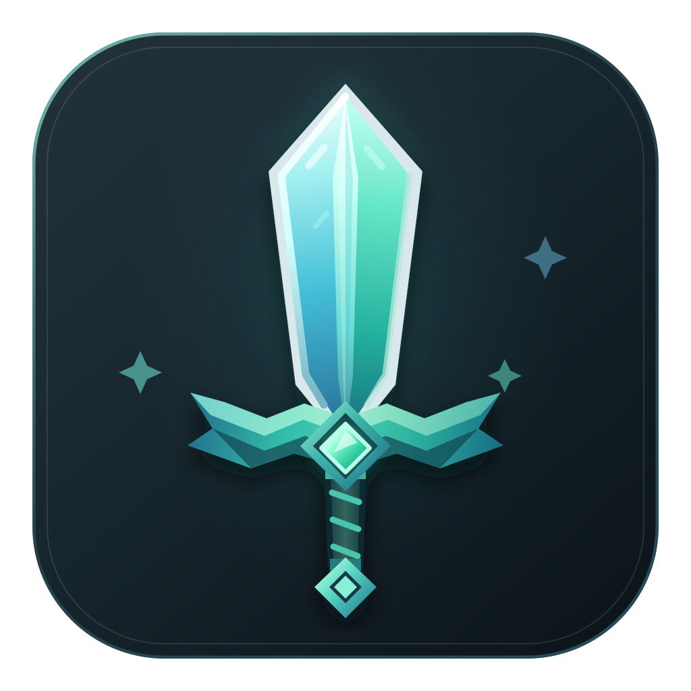
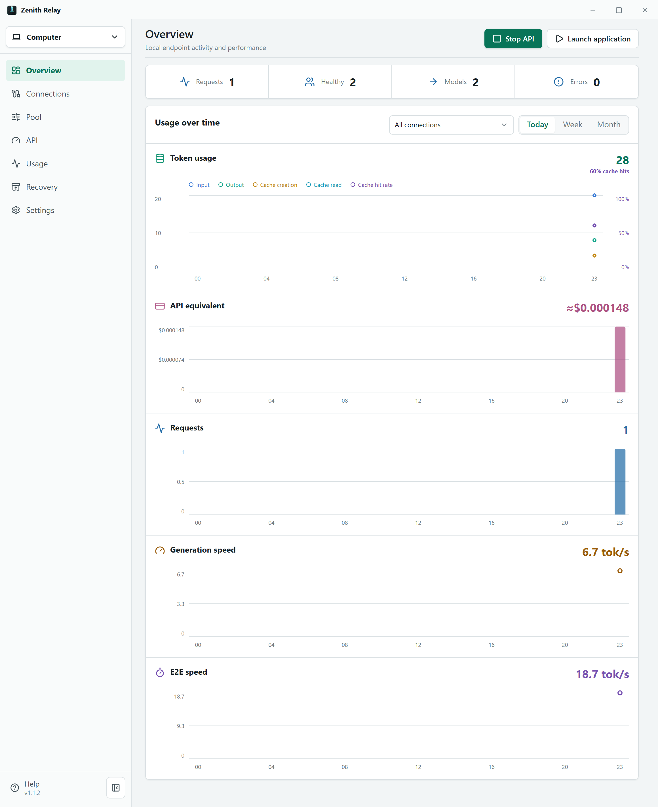
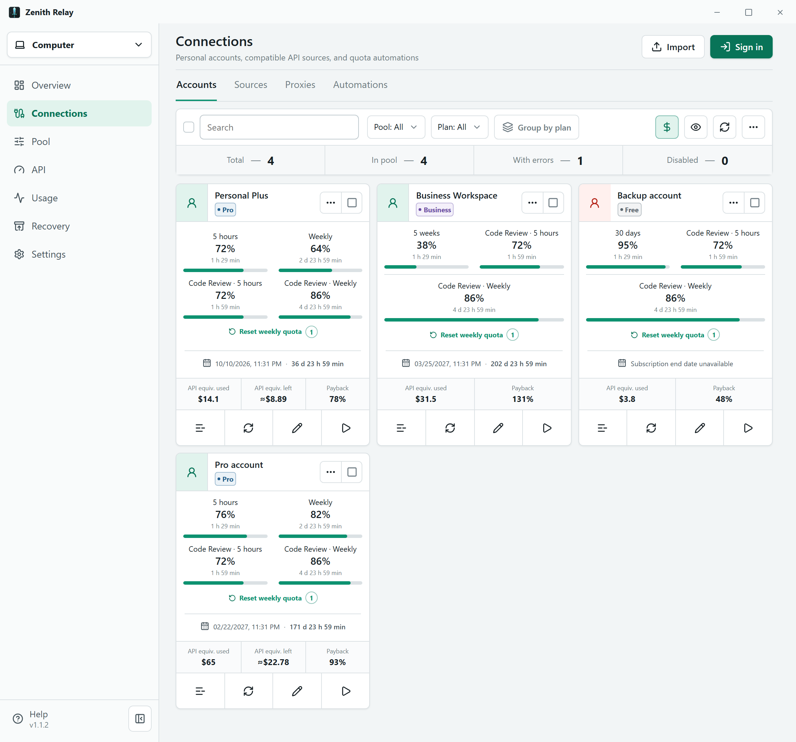
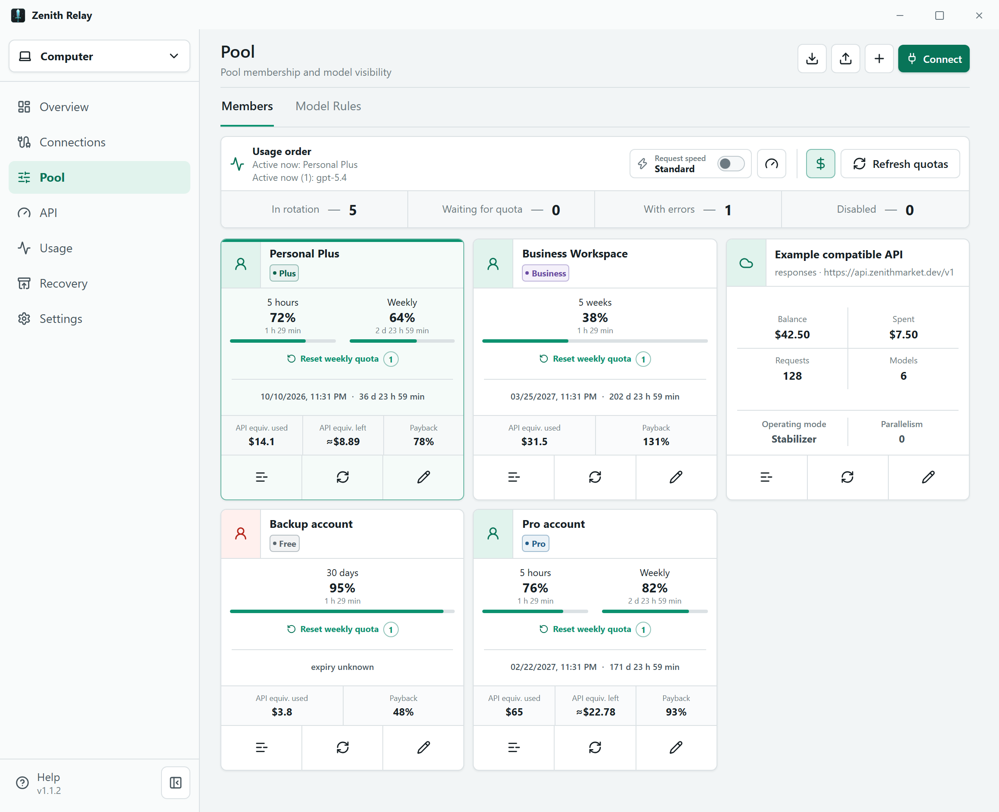
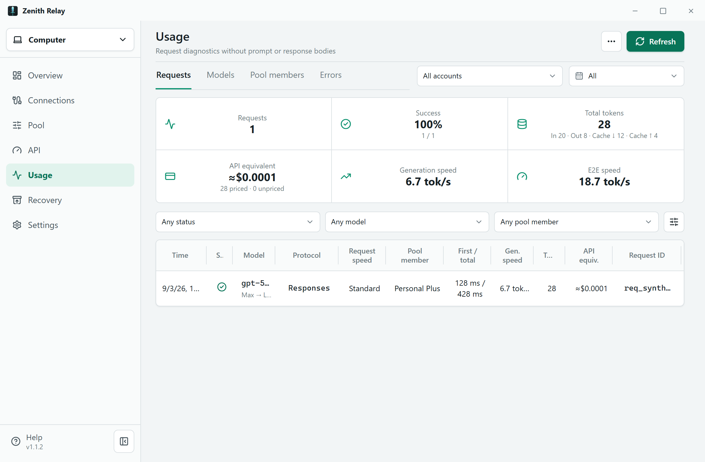

<div align="center">
  
  <h1>Zenith Relay</h1>
  <p>Personal desktop relay for ChatGPT, OpenCode, and compatible APIs.</p>
  <p>
    <a href="https://github.com/F0RLE/zenith-relay/releases/latest"></a>&nbsp;
    <a href="docs/help/en/README.md"></a>&nbsp;
    <a href="docs/help/ru/README.md"></a>&nbsp;
    <a href="LICENSE"></a>
  </p>
</div>

<p align="center">
  Zenith Relay keeps user-owned ChatGPT accounts and compatible API sources in
  one place, lets you choose which connections receive requests, and exposes
  one private OpenAI-compatible endpoint.<br>
  Relay-managed ChatGPT settings are reversible, and OpenCode keeps its
  original configuration for recovery.
</p>

## Download

Download the package for your platform from
[GitHub Releases](https://github.com/F0RLE/zenith-relay/releases/latest).

- **Windows:** use the Setup installer. The portable EXE runs without
  installation, but its folder must be writable for in-place updates.
- **Linux:** choose AppImage, DEB, or RPM.
- **macOS:** choose the DMG for Intel or Apple Silicon.

The first launch opens Quick Setup. Choose where Relay should run, add a
connection, and select the client that will use the endpoint. Quick Setup can
be opened again from **Help**.

## Choose a mode

| Mode | Use it when | What remains running |
| --- | --- | --- |
| **This computer** | You want to combine personal accounts without deploying a server. | Relay and the local endpoint must stay open. |
| **Choose API** | You already have a compatible hosted API and its key. | The provider runs the requests. |
| **My server** | You operate a Relay Server for continuous or remote access. | The server runs the pool. |

## Everyday workflow

1. Open **Connections** and add a ChatGPT account, an API source, or a proxy.
2. In **Pool**, include the connections and models that may receive traffic.
3. Start the endpoint in **API**, open the **Application** tab, and connect
   ChatGPT or OpenCode when needed.
4. Use **Overview** for status and performance, **Usage** for request history,
   and **Recovery** to restore Relay-managed ChatGPT settings or the saved
   OpenCode configuration.

The complete behavior and troubleshooting guidance are kept in the in-app
**Help** section and the [English guide](docs/help/en/README.md).

## Screenshots

<table>
  <tr>
    <td align="center" width="50%"></td>
    <td align="center" width="50%"></td>
  </tr>
  <tr>
    <td align="center" width="50%"></td>
    <td align="center" width="50%"></td>
  </tr>
</table>

## Help

The same user guide is available in the application and in the repository:

| Language | Guide |
| --- | --- |
| English | [Open the guide](docs/help/en/README.md) |
| Русский | [Открыть справку](docs/help/ru/README.md) |

## For contributors

Development and release checks are documented in
[CONTRIBUTING.md](CONTRIBUTING.md). Current product boundaries live in
[PLANNING.md](docs/project/PLANNING.md); unfinished work is tracked in the
[roadmap](docs/project/ROADMAP.md).

```powershell
cd src
bun install
bun run verify
bun run test:e2e
bun run screenshots
```
