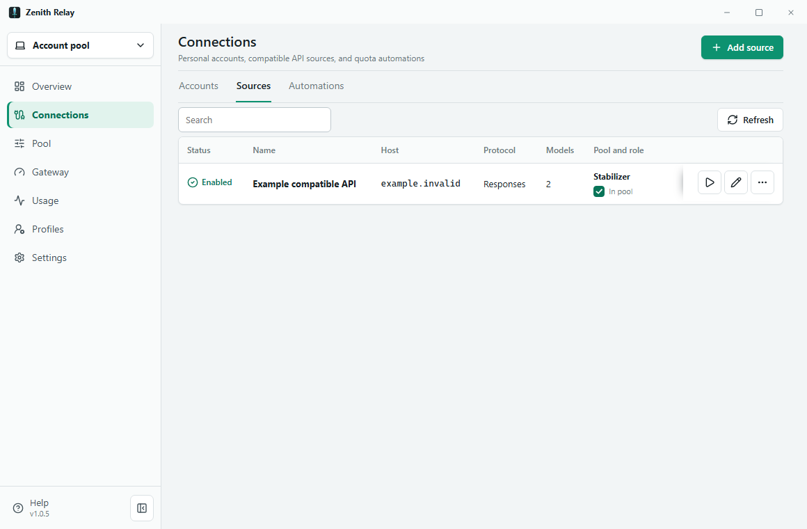

# Zenith Relay

Zenith Relay is a Tauri desktop application for routing a user's own accounts
and compatible APIs through one OpenAI-compatible endpoint.

```text
Codex / OpenCode / another client
              |
      one local or remote /v1 endpoint
              |
   scoped client key and per-request scheduler
              |
  OAuth account or user-owned compatible API
```

## Runtime Modes

- **This computer** runs a private loopback endpoint from the desktop app.
- **My server** manages the same personal pool on a server controlled by the
  user, so requests continue while the desktop is closed.
- **Ready API** connects Codex to Zenith API and shows balance, usage, and
  top-up actions without exposing the saved key to the frontend.

Personal pool features include OAuth accounts, compatible API sources, quota
windows and reset times, a shared scheduler, local client keys, model rules,
usage diagnostics, quota-wake automation, profile backup/restore, and RU/EN UI.

The public app never contains Zenith private selling-pool inventory, billing,
provider economy, or internal routing policy. User credentials stay in the
device secret store or encrypted vault on the server selected by that user.

## Product Tour

All screenshots use synthetic Playwright data. They contain no real account,
API key, proxy, prompt, or response content.

### Overview

The first screen shows the active endpoint, usable capacity, visible models,
errors, and recent request health.


### Connections And Pool

Connections are the user's inventory. Adding an account or API source does not
silently enable it for traffic. The user chooses pool membership, then assigns
an API source as `API first`, `Stabilizer`, or `Last resort`.

| API sources | Pool routing order |
| --- | --- |
|  |  |

### Usage

Usage keeps request metadata, latency, token classes, routing attempts, and
errors without storing prompt or response bodies.


## Screen Responsibilities

- **Connections** owns accounts, compatible API sources, proxies, import/export,
  OAuth sign-in, and quota-wake automation.
- **Pool** owns traffic eligibility, API-source roles, client access keys, model
  visibility, quota refresh, and routing policy.
- **Gateway** owns the local endpoint, bind scope, common proxy, Codex setup,
  diagnostics, and redacted support bundles.
- **Usage** owns request, model, connection, latency, token, and error views.
- **Profiles** owns reversible Codex/OpenCode attachment, snapshots, restore,
  and repair.
- **Settings** owns language, theme, local storage, updates, security, and data
  recovery.

## Components

- `src` - React/Vite frontend and Playwright tests.
- `src-tauri` - Rust/Tauri desktop host, OS secret storage, OAuth, local
  endpoint, client profiles, and remote management client.
- `crates/relay-core` - shared scheduler, gateway, quota, automation, protocol,
  usage, and redaction logic.
- `relay-server` - standalone encrypted user-managed runtime.
- `docs` - product, architecture, runtime, UX, and active release gates.

Start with the [documentation map](docs/README.md). Exact paths and ownership
live in [project-structure.md](docs/project-structure.md); unfinished release
work lives in [local-pool-final-planning.md](docs/local-pool-final-planning.md).

## Development

```bash
cd src
bun install
bun run app:dev
```

Verification:

```bash
cd src
bun run verify
bun run test:e2e
bun run app:build
```

Dependency and server gates:

```bash
cd src
bun audit
cd ..
cargo audit --file src-tauri/Cargo.lock
cargo audit --file relay-server/Cargo.lock
cargo build --manifest-path relay-server/Cargo.toml --release --locked
```

Run the user-managed server:

```bash
cargo run --manifest-path relay-server/Cargo.toml --release
```

See [relay-server/README.md](relay-server/README.md) for encrypted deployment,
backup, and restore instructions.

## Platforms

The release workflow builds Windows x64/ARM64, macOS Intel/Apple Silicon, and
Linux x64/ARM64. Release artifacts include portable/setup/MSI packages on
Windows, app/DMG packages on macOS, and AppImage/DEB/RPM packages on Linux.

## Zenith API

The recommended Ready API preset is:

```text
https://api.zenithmarket.dev/v1
```

Telegram top-up bot: [@zenith_service_bot](https://t.me/zenith_service_bot)

Public API documentation: [docs.zenithmarket.dev](https://docs.zenithmarket.dev)

## License

Copyright (C) 2026 FORLE. Licensed under
[GNU Affero General Public License v3.0 only](LICENSE) (`AGPL-3.0-only`).
