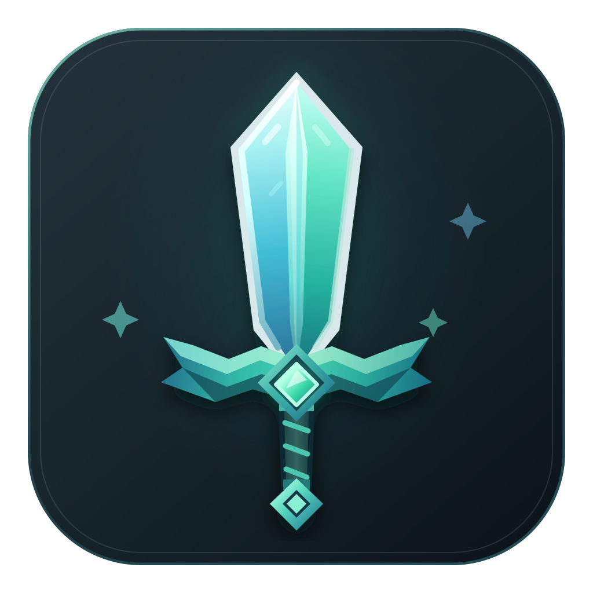
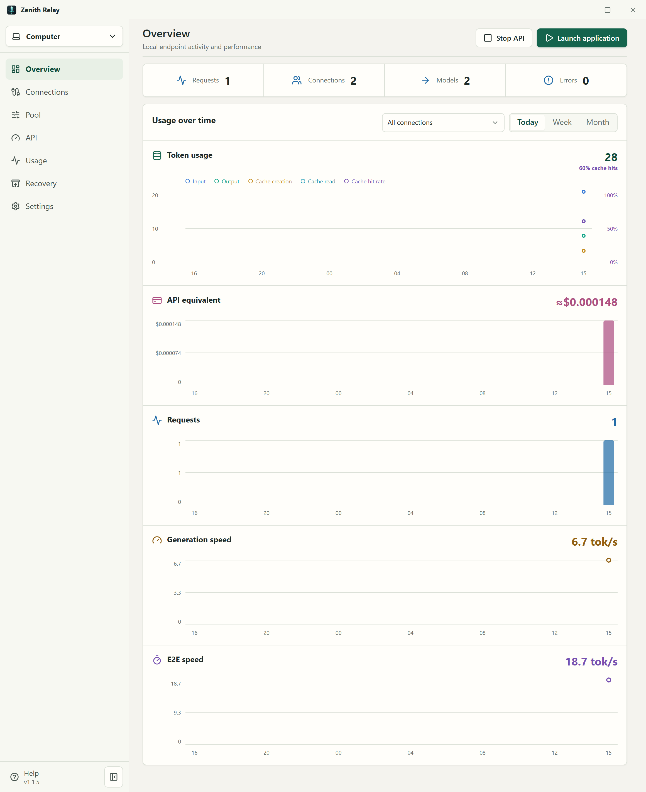
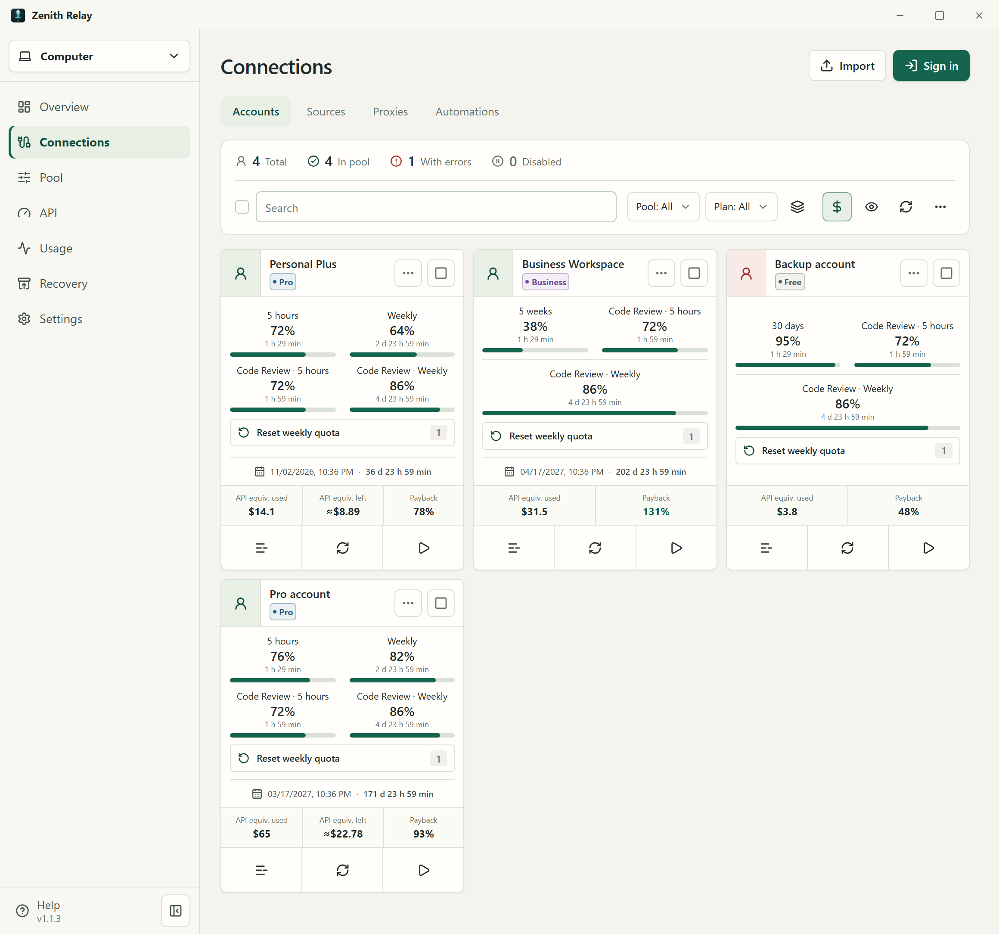
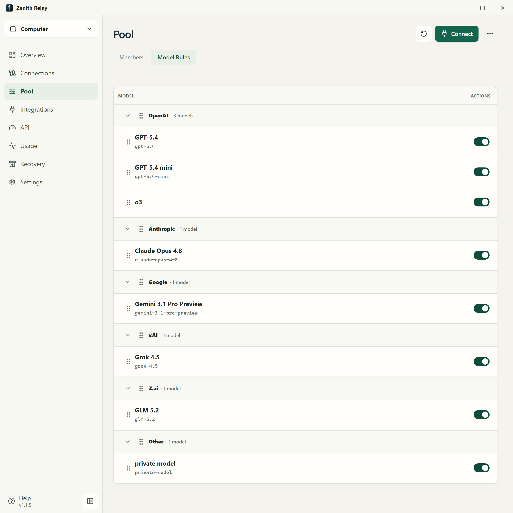
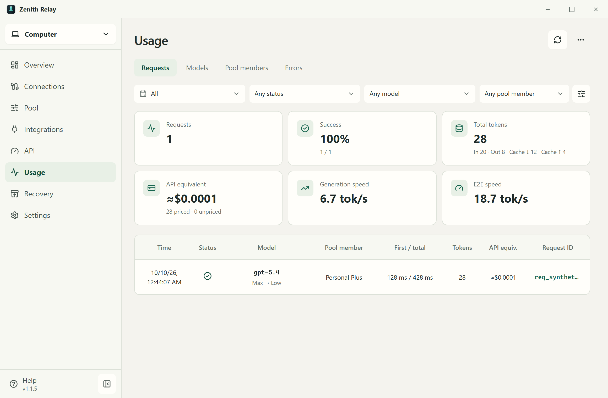

<div align="center">
  
  <h1>Zenith Relay</h1>
  <p>Personal desktop relay for ChatGPT, OpenCode, and compatible APIs.</p>
  <p>
    <a href="https://github.com/F0RLE/zenith-relay/releases/latest"></a>&nbsp;
    <a href="docs/help/en/README.md"></a>&nbsp;
    <a href="docs/help/ru/README.md"></a>&nbsp;
    <a href="LICENSE"></a>
  </p>
</div>

<p align="center">
  Zenith Relay keeps user-owned ChatGPT accounts and compatible API sources in
  one place, lets you choose which connections receive requests, and exposes
  one private OpenAI-compatible endpoint.<br>
  Relay-managed ChatGPT settings are reversible, and OpenCode keeps its
  original configuration for recovery.
</p>

## Direction

Relay is intended to grow into a user-owned, multi-provider account pool for
coding clients. The long-term direction is to connect permitted accounts and
API sources to Codex, OpenCode, Claude Code, and compatible clients, keeping a
provider's native protocol when possible and using a typed adapter when the
requested conversion is supported.

This is a roadmap direction, not a claim that every provider or subscription
connector is supported today. Current behavior is defined by
[PLANNING.md](docs/project/PLANNING.md); staged work and live acceptance gates
are tracked in the [roadmap](docs/project/ROADMAP.md).

The server direction uses the desktop as the control plane and Relay Server as
the data plane. A paired server can receive an explicitly published, encrypted
configuration revision containing the pool, connections, ordering, model
policies, and prices, then continue serving requests while the desktop is
closed. A later hosted mode can add scoped user keys, per-model USD prices,
quota, balance and usage accounting, and redacted live request telemetry. That
mode needs its own tenant, billing, and provider-permission contracts; it is a
separate expansion of the user-managed server path.

## Download

Download the package for your platform from
[GitHub Releases](https://github.com/F0RLE/zenith-relay/releases/latest).

- **Windows:** use the Setup installer. The portable EXE runs without
  installation, but its folder must be writable for in-place updates.
- **Linux:** choose AppImage, DEB, or RPM.
- **macOS:** choose the DMG for Intel or Apple Silicon. This build is ad-hoc
  signed and is not Apple notarized; follow the one-time [English](docs/help/en/README.md#install-on-macos)
  or [Russian](docs/help/ru/README.md#установка-на-macos) installation steps.

The first launch opens Quick Setup. Choose whether the shared pool runs on
this computer or your server, add accounts and API sources to it, then select
the client. You can add more connections later. Quick Setup can be opened
again from **Help**.

## Choose a mode

| Mode | Use it when | What remains running |
| --- | --- | --- |
| **Computer** | You want to combine personal accounts and API sources without deploying a server. | The Relay process and its local API. Closing the window leaves them in the tray. |
| **Choose API** | You want to connect an application directly to one saved API source. Choose this after setup. | The provider runs the requests. Pool, API, and Usage are hidden. |
| **On your server** | You operate a Relay Server for continuous or remote access. | The server runs the pool. Closing the desktop app does not stop it. |

## Everyday workflow

For a pool in **Computer** mode:

1. Open **Connections** and add a ChatGPT account or an API source. Configure
   a proxy there if needed.
2. In **Pool**, include the connections and models that may receive traffic.
3. Start the endpoint in **API**, then use **Pool → Connect** to connect
   ChatGPT or OpenCode. Other compatible clients use the displayed API address
   and request key.
4. Use **Overview** for status and performance, **Usage** for request history,
   and **Recovery** to restore Relay-managed ChatGPT settings or the saved
   OpenCode configuration.

**Choose API** connects directly to the selected provider without pool
rotation. The ChatGPT interface account is separate from the member chosen
to serve a request through the pool.

The complete behavior and troubleshooting guidance are kept in the in-app
**Help** section and the [English guide](docs/help/en/README.md).

## Screenshots

<table>
  <tr>
    <td align="center" width="50%"></td>
    <td align="center" width="50%"></td>
  </tr>
  <tr>
    <td align="center" width="50%"></td>
    <td align="center" width="50%"></td>
  </tr>
</table>

## Help

The same user guide is available in the application and in the repository:

| Language | Guide |
| --- | --- |
| English | [Open the guide](docs/help/en/README.md) |
| Русский | [Открыть справку](docs/help/ru/README.md) |

## For contributors

Development and release checks are documented in
[CONTRIBUTING.md](CONTRIBUTING.md). Current product boundaries live in
[PLANNING.md](docs/project/PLANNING.md); unfinished work is tracked in the
[roadmap](docs/project/ROADMAP.md).

The project is licensed under [AGPL-3.0-only](LICENSE). Before submitting a PR,
read the [Contributor Agreement](CONTRIBUTOR_LICENSE_AGREEMENT.md): accepted
original contributions are assigned to the project owner, with a license back
to their authors. Existing AGPL grants and third-party rights remain unchanged.

```sh
bun scripts/setup/start-dev.mjs
```

`bun run start` installs the locked frontend and Rust dependencies, then starts
the desktop app on Windows, macOS, and Linux. The same command from `src` is
`bun run start`. Install Bun 1.4.2 or newer, rustup, and the native desktop
libraries first; the script does not install those platform tools. Add
`--with-browsers` when Playwright Chromium is needed for end-to-end tests. Run
`bun run verify` for the frontend and desktop verification gate.
Before a pull request, run the guardrail and duplicate-code checks in
[CONTRIBUTING.md](CONTRIBUTING.md).
