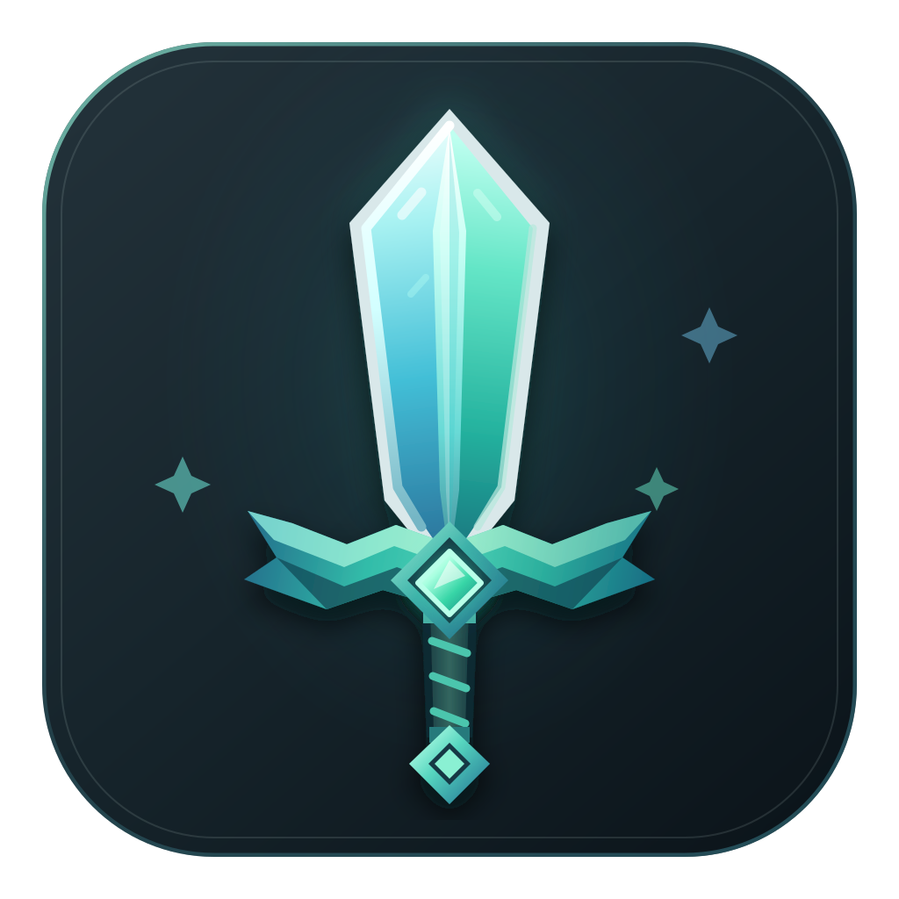
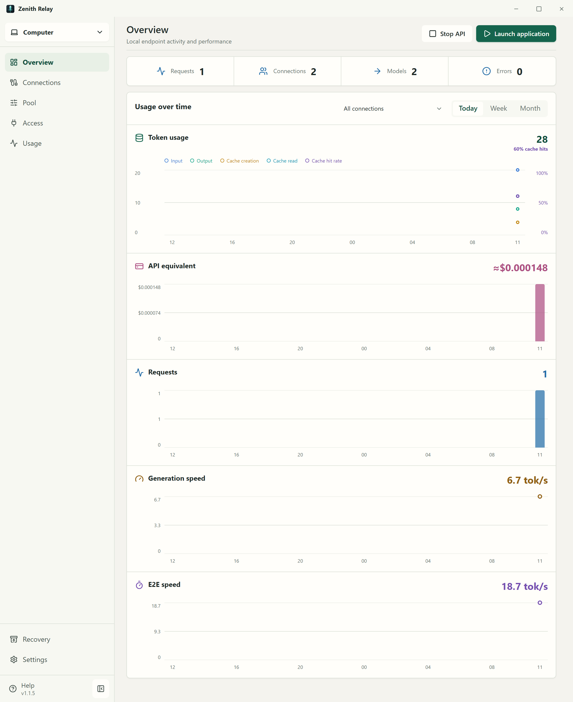
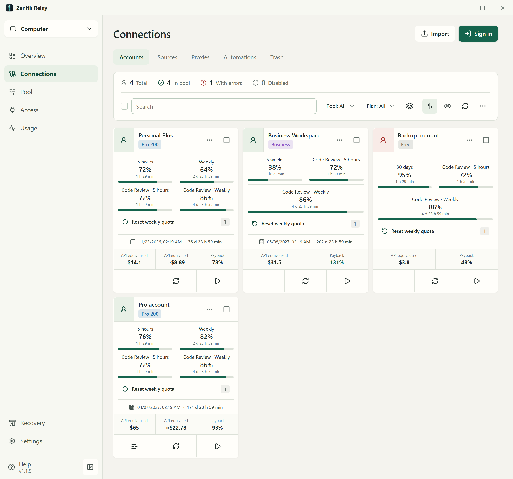
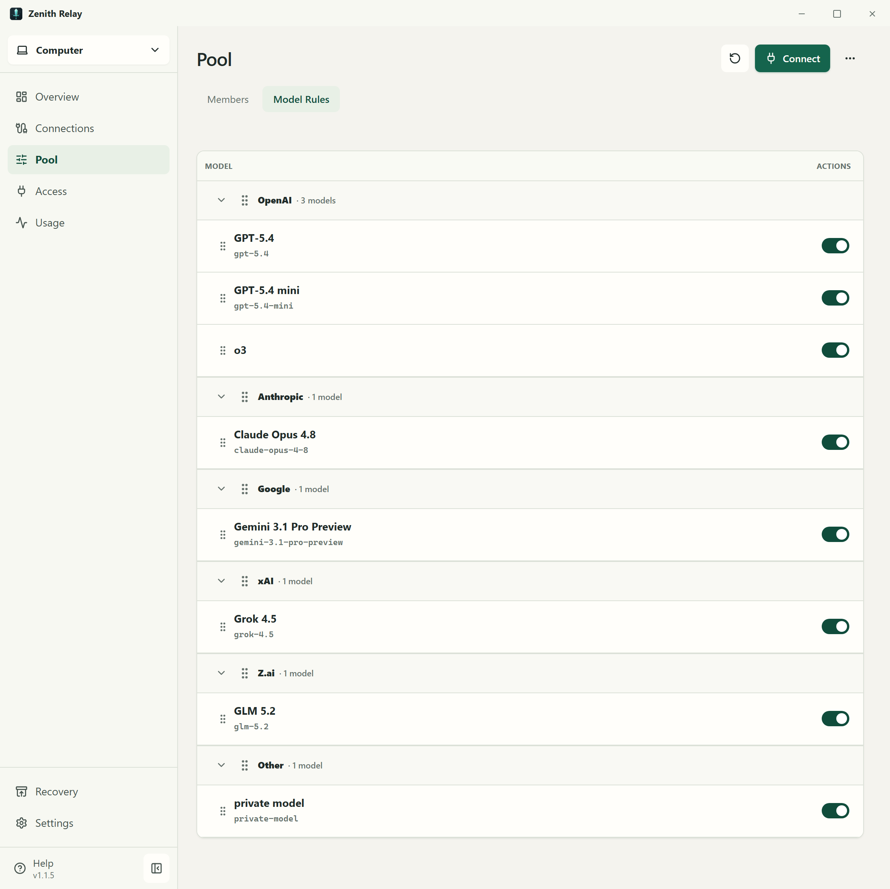
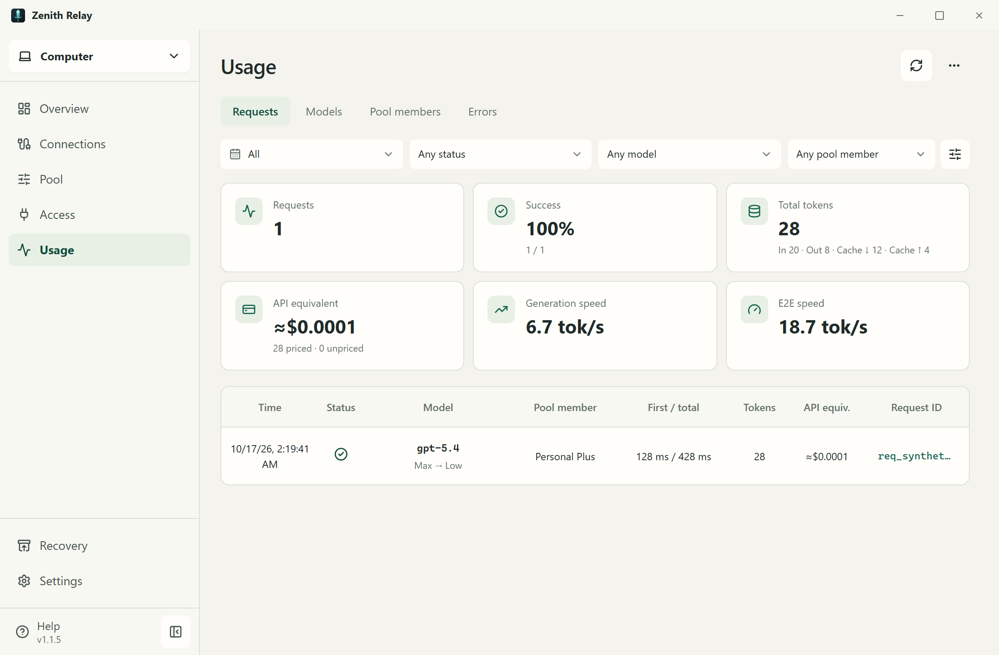

<div align="center">
  
  <h1>Zenith Relay</h1>
  <p>Personal desktop relay for ChatGPT, Claude Desktop, OpenCode, and API clients.</p>
  <p>
    <a href="https://github.com/F0RLE/zenith-relay/releases/latest"></a>&nbsp;
    <a href="docs/help/en/README.md"></a>&nbsp;
    <a href="docs/help/ru/README.md"></a>&nbsp;
    <a href="LICENSE"></a>
  </p>
</div>

<p align="center">
  Relay keeps user-owned accounts and API sources in one place, selects an
  eligible connection for each request, and exposes a private compatible API.
</p>

## What it does

- Combines ChatGPT/SIWC, Excel / Basis Points, and compatible API sources in a local pool; Codex connections support direct account switching.
- Connects installed ChatGPT, Claude Desktop, and OpenCode, or another client through
  a compatible API. Relay does not install those applications.
- Selects an available pool member for each request and shows its status,
  quota, and request history.
- Supports direct use of one account or API source without pool rotation.
- Keeps the local pool running in the tray when the window is closed; optionally
  shares its API with other devices on a trusted LAN.

Bring your own account or provider API key. Conversations stay in your chosen
client; Relay manages connections and routing. Usage costs are estimates, not
a Relay subscription or bill.

## Download

Download a package for your platform from
[GitHub Releases](https://github.com/F0RLE/zenith-relay/releases/latest).

- **Windows:** use the Setup installer or the portable EXE. The portable folder
  must be writable for in-place updates.
- **Linux:** choose AppImage, DEB, or RPM.
- **macOS:** choose the DMG for Intel or Apple Silicon. It is ad-hoc signed and
  not notarized; follow the [English](docs/help/en/README.md#install-on-macos)
  or [Russian](docs/help/ru/README.md#установка-на-macos) first-launch steps.

## Modes

| Mode | Use it when | What remains running |
| --- | --- | --- |
| **Computer** | Run the pool on this device, optionally sharing its API on a trusted LAN. | Relay and its local API. Closing the window leaves the process in the tray. |
| **Relay Hosted** | In development; no hosted connection is made. | Selecting it does not stop the local API. |

Computer mode also launches an application with one saved API source directly,
without pool rotation, from **Connections → Sources → Launch**.

The retired personal-server mode is removed. Hosted is a separate future service;
local network access remains part of Computer mode.

## Quick start

1. Select **Computer**.
2. In **Connections → Accounts → Sign in**, choose **Codex**, **ChatGPT (SIWC)**
   or **Excel / Basis Points**, or add an API source under **Connections → Sources**.
3. In **Pool → Members**, add the saved connections. Check **Model Rules**
   for the model you want to use.
4. Start the API under **Access → Local API**, then use **Pool → Connect**
   for ChatGPT, Claude Desktop, or OpenCode. Other clients use the API address and request key
   from **Access**.
5. Send a request from the client and find it in **Usage → Requests**.

These authorizations stay independent. In local account cards, the **Codex**,
**SIWC** or **Excel / BPS** badge next to the plan selects one route. **Account
connections** can explicitly group matching authorizations without duplicate pool
members or combined quota. **Codex** supports direct account switching and linked
SIWC quota display, not pool membership.
**ChatGPT (SIWC)** is pool-only and requires plan-use permission in the browser.
**Excel / Basis Points** is pool-only and requires a non-Free account; Free BPS
imports and requests are rejected. Codex accounts remain available outside the pool.
All three support [Zenith export/import](docs/help/en/README.md#import-export-and-account-state).
SIWC supports only Zenith and requires a fresh sign-in after import; existing SIWC
connections are not overwritten. Exported files contain secrets: store them like passwords.
The guide covers [direct use](docs/help/en/README.md#work-without-the-pool),
[manual API setup and LAN access](docs/help/en/README.md#local-api), and
[saved account recovery](docs/help/en/README.md#saved-account-recovery).

The full user guide is available in the application and in
[English](docs/help/en/README.md) and [Russian](docs/help/ru/README.md).
Quick Setup guides the first launch and can be opened again from **Help**.
Use **Recovery** to restore saved client settings.

## Screenshots

<table>
  <tr>
    <td align="center" width="50%"></td>
    <td align="center" width="50%"></td>
  </tr>
  <tr>
    <td align="center" width="50%"></td>
    <td align="center" width="50%"></td>
  </tr>
</table>

## Development

Use the [documentation index and repository tree](docs/README.md) to find the
owning guide or source directory.

Read [CONTRIBUTING.md](CONTRIBUTING.md) before changing the project.
Implemented contracts are mapped in [PLANNING.md](docs/project/PLANNING.md);
open Desktop work is in the [roadmap](docs/project/ROADMAP.md), and future Hosted
delivery has a [separate plan](docs/hosted/HOSTED_RELAY_ROADMAP.md). The project uses
[AGPL-3.0-only](LICENSE). Before submitting a pull request, read the
[Contributor Agreement](CONTRIBUTOR_LICENSE_AGREEMENT.md).

The [model catalog](catalog/README.md) documents the shared display-order
policy and the JSON export for other applications.

```sh
bun scripts/setup/start-dev.mjs
```

The same command is available as `bun run start` from `src`. It prepares locked
frontend and Rust dependencies, then starts the desktop app. Install Bun,
rustup, and the platform's native desktop libraries first. Use
`bun run setup:browsers` only when Playwright browsers are needed.
